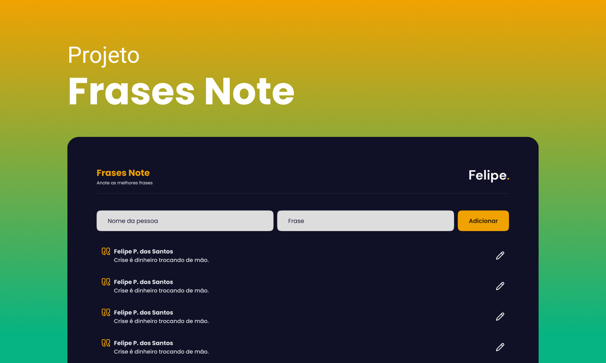

[Link do deploy](https://frases-note-react.vercel.app/)

Um site para armazenar as frases mais marcantes de uma maneira simples e bonita, com a funcionalidade de exportar em texto ou PDF.

## Objetivo do Projeto

Sempre gostei de anotar as frases impactantes dos meus amigos, professores, livros, etc., mas essas anotações acabavam se perdendo no meio de outras. Para resolver isso, criei um site dedicado exclusivamente para anotar essas frases, incentivando a anotar e recordar delas.

## Tecnologias Utilizadas

- **React.js**: Utilizado para o desenvolvimento do front-end.
- **LocalStorage**: Usado para armazenar as frases.
- **Figma**: Utilizado para criar o protótipo e design do site.

## Funcionalidades

- **Adicionar Frases**: Permite ao usuário adicionar novas frases.
- **Excluir Frases**: Permite ao usuário excluir frases existentes.
- **Alterar Frases**: Permite ao usuário editar frases existentes.
- **Exportar Frases**: Permite ao usuário exportar as frases em formato PDF ou texto através da área de transferência.

## Como Instalar o Projeto

1. Clone o repositório:

   ```bash
   git clone https://github.com/Tiodevs/Frases-Note-React.git
2. Navegue até o diretório do projeto:

    ```bash
    cd Frases-Note-React
3. Instale as dependências::

    ```bash
    npm install
4. Clone o repositório:

    ```bash
    npm start
1. O projeto estará disponível em `http://localhost:3000`.